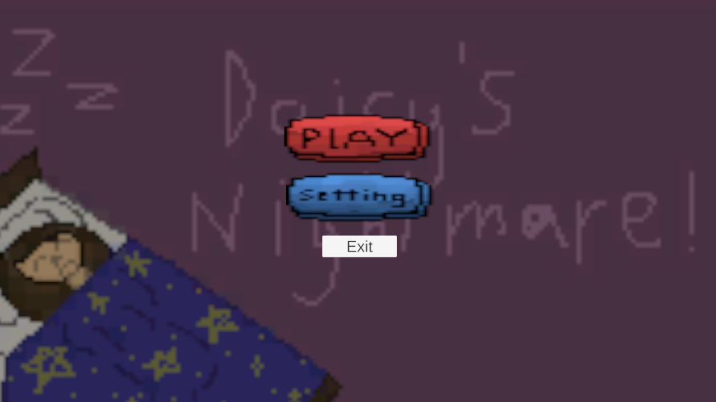

# Unity Game Development Summary

| Field | Detail |
|---|---|
| **Game Title** | Daisy Dash |
| **Student Name(s)** | Daniel L |
| **Class / Course** | Computer Technology |
| **Repository** | https://github.com/TempeHS/2026CT_GameDesign_DaisyDash_Daniel.L |
| **Unity Version** | 6000.0.58f1 |
| **Document Version** | 0.1 |
| **Date** | 27/08/2026 |

---

## Table of Contents
1. [Game Overview](#1-game-overview)
2. [Video Walkthrough](#2-video-walkthrough)
3. [Game Mechanics](#3-game-mechanics)
4. [Visual Features](#4-visual-features)
5. [Audio Design](#5-audio-design)
6. [User Interface & HUD](#6-user-interface--hud)
7. [Scene & Level Design](#7-scene--level-design)
8. [Scripts & Programming](#8-scripts--programming)
9. [Development Techniques & Tutorials Acknowledged](#9-development-techniques--tutorials-acknowledged)
10. [Third-Party Content Acknowledgements](#10-third-party-content-acknowledgements)
11. [Challenges & Solutions](#11-challenges--solutions)
12. [Branch Development Summary](#12-branch-development-summary)

---

## 1. Game Overview

### 1.1 Genre
2D platformer

### 1.2 Target Audience
Players who enjoy fast-paced, challenging platform games, including students and casual gamers who like mastering movement, hazards, and timed level runs.

### 1.3 Game Summary
Daisy Dash is a 2D platformer in which the player navigates platforming levels using running, jumping, wall jumping, climbing, and dashing. A mouse-controlled flashlight reveals hidden blocks and routes, while checkpoints provide progress through the level. Players must avoid hazard blocks and reach the finish line as quickly as possible.

### 1.4 Win / Loss Conditions
| Condition | Description |
|---|---|
| Win | Reach the finish line. The level timer stops and the game loads the next level when one is available. |
| Loss | Touch a hazard or otherwise fail a platforming section. The player respawns at the most recently activated checkpoint and can continue the run. |

### 1.5 Platform & Build Settings
| Setting | Detail |
|---|---|
| Target Platform | Pc |
| Resolution | 1980x1080 |
| Build Type | Windows x64 |

---

## 2. Video Walkthrough

### 2.1 Full Gameplay Walkthrough

<!--
  Embed a YouTube/Vimeo video or link to a file in the repository.
  YouTube embed syntax:
  

  OR link to a local file:
  [Watch Walkthrough Video](./docs/video/walkthrough.mp4)
-->

| Field | Detail |
|---|---|
| **Video Title** | Daisy Dash: Feature Walkthrough |
| **Link / Embed** | |
| **Duration** | |
| **Description** | |

### 2.2 Feature Highlight Clips

| Clip | Description | Link |
|---|---|---|
| | | |
| | | |
| | | |

---

## 3. Game Mechanics

### 3.1 Core Mechanics
| ID | Mechanic | Description | Implemented In (Script/Object) |
|---|---|---|---|
| M-1 | | | |
| M-2 | | | |
| M-3 | | | |
| M-4 | | | |
| M-5 | | | |

### 3.2 Player Controls
| Action | Input (Keyboard / Controller) | Description |
|---|---|---|
| Walk | A & D | Left and right movement |
| Jump | Space | Allows player to jump |
| Dash | Shift | Gives player a quick speed boost |
| Climbing | C | Allows player to climb walls |

### 3.3 Physics & Collision
| Feature | Description |
|---|---|
| | |
| | |
| | |

### 3.4 Game Loop
| Stage | Description |
|---|---|
| Start / Initialisation | |
| Core Loop | |
| Win / End State | |
| Restart | |

### 3.5 Scoring & Progression
| Element | Description |
|---|---|
| Scoring System | |
| Difficulty Progression | |
| Unlockables / Levels | |

---

## 4. Visual Features

### 4.1 Particle Effects

| Effect Name | Purpose | Screenshot |
|---|---|---|
| | | |
| | | |
| | | |
| | | |

> Add screenshot images using: ``

---

### 4.2 Cut Scenes & Cinematics

| Cut Scene | Trigger | Description | Screenshot / Still |
|---|---|---|---|
| | | | |
| | | | |
| | | | |

> Add screenshot images using: ``

---

### 4.3 Animations

| Animation | Object / Character | Description | Screenshot |
|---|---|---|---|
| | | | |
| | | | |
| | | | |

> Add screenshot images using: ``

---

### 4.4 Lighting & Post-Processing

| Feature | Description | Screenshot |
|---|---|---|
| | | |
| | | |
| | | |

> Add screenshot images using: ``

---

### 4.5 Shaders & Materials

| Shader / Material | Applied To | Description | Screenshot |
|---|---|---|---|
| | | | |
| | | | |
| | | | |

> Add screenshot images using: ``

---

### 4.6 Additional Visual Screenshots

<!--
  Add any other notable screenshots here.
  Syntax: 
-->

| Description | Screenshot |
|---|---|
| | |
| | |
| | |

---

## 5. Audio Design

### 5.1 Music
| Track | Scene / Trigger | Source / Composer |
|---|---|---|
| None | | |
| | | |

### 5.2 Sound Effects
| Sound Effect | Trigger | Source |
|---|---|---|
| None | | |
| | | |
| | | |
| | | |

### 5.3 Audio Implementation
| Feature | Description |
|---|---|
| Audio Mixer / Groups | |
| Spatial / 3D Audio | |
| Dynamic Audio | |

---

## 6. User Interface & HUD

### 6.1 HUD Elements
| Element | Purpose | Screenshot |
|---|---|---|
| | | |
| | | |
| | | |

> Add screenshot images using: ``

### 6.2 Menus
| Menu | Purpose | Screenshot |
|---|---|---|
| Main Menu | |  |
| Pause Menu | | |
| Game Over Screen | | |
| | | |

> Add screenshot images using: ``

---

## 7. Scene & Level Design

### 7.1 Scene List
| Scene Name | Purpose | Description |
|---|---|---|
| Menu | | |
| Level1 | | |
| Level2 | | |
| | | |

### 7.2 Level / Environment Screenshots
| Level / Area | Description | Screenshot |
|---|---|---|
| | | |
| | | |
| | | |

> Add screenshot images using: ``

### 7.3 Scene Management
| Feature | Description |
|---|---|
| Scene Loading Method | |
| Persistent Data Between Scenes | |
| Scene Transition Effects | |

---

## 8. Scripts & Programming

### 8.1 Script Summary
| Script Name | Attached To | Responsibility |
| --- | --- | --- |
| **Checkpoint.cs** | Checkpoints | Stores & updates player respawn position when touched. |
| **FinishLine.cs** | Finish line | Detects level completion; stops timer and triggers next scene. |
| **FlashlightControls.cs** | Flashlight | Rotates flashlight toward mouse, keeps flashlight on player, handles on/off toggle. |
| **FlashlightReveal.cs** | Hidden blocks | Shows/hides hidden blocks when shone by flashlight. |
| **HazardBlock.cs** | Hazard blocks | Detects player collision with hazards and triggers respawn. |
| **PlayerMovement.cs** | Player | Handles player input, movement, jumping and physics. |
| **RespawnManager.cs** | Player | Tracks current checkpoint and respawns player there after death or hazard collision. |
| **Restart.cs** | Not functional | Intended to restart level but currently does not work. |
| **StartMenuController.cs** | Start menu controller object | Controls start menu UI, button actions play/quit, and scene transitions. |
| **TimerManager.cs** | Timer object | Tracks and displays time passed; used for level timing and stops when reaching end. |

### 8.2 Key Algorithms / Logic
| Feature | Script | Description |
|---|---|---|
| | | |
| | | |
| | | |

### 8.3 Design Patterns Used
| Pattern | Where Applied | Justification |
|---|---|---|
| | | |
| | | |
| | | |

---

## 9. Development Techniques & Tutorials Acknowledged

> List every tutorial, course, video, or article that informed or guided your implementation. Include what you used it for and what you changed or adapted.

| # | Title | Author / Creator | URL / Source | What You Used It For | What You Changed / Adapted |
|---|---|---|---|---|---|
| 1 | | | | | |
| 2 | | | | | |
| 3 | | | | | |
| 4 | | | | | |
| 5 | | | | | |
| 6 | | | | | |
| 7 | | | | | |
| 8 | | | | | |

---

## 10. Third-Party Content Acknowledgements

> All third-party assets (art, audio, fonts, scripts, packages) must be listed here with their licence. Using an asset without acknowledgement may constitute academic misconduct.

### 10.1 Visual Assets
| Asset Name | Type | Creator / Source | Licence | URL | Used For |
|---|---|---|---|---|---|
| | | | | | |
| | | | | | |
| | | | | | |

### 10.2 Audio Assets
| Asset Name | Type | Creator / Source | Licence | URL | Used For |
|---|---|---|---|---|---|
| | | | | | |
| | | | | | |
| | | | | | |

### 10.3 Scripts & Code Snippets
| Script / Snippet | Source | Licence | URL | Used For | Changes Made |
|---|---|---|---|---|---|
| | | | | | |
| | | | | | |

### 10.4 Unity Packages & Plugins
| Package Name | Version | Source | Licence | URL | Purpose |
|---|---|---|---|---|---|
| | | | | | |
| | | | | | |
| | | | | | |

### 10.5 Fonts
| Font Name | Creator / Source | Licence | URL |
|---|---|---|---|
| | | | |
| | | | |

---

## 11. Challenges & Solutions

| # | Challenge Encountered | How It Was Solved |
|---|---|---|
| 1 | | |
| 2 | | |
| 3 | | |
| 4 | | |
| 5 | | |

---

## 12. Branch Development Summary

> One section per feature branch. Add or remove sections to match your repository. Branches should be named for the feature they implement e.g. `feature/player-movement`. Link each branch name directly to the branch in your GitHub repository.

---

### Branch 1 — `main`

| Field | Detail |
|---|---|
| **Branch Name** | `main` |
| **Purpose** | Stable, releasable version of the game |
| **Merged From** | |
| **Final Commit** | |

---

### Branch 2 — `feature/camera`

| Field | Detail |
|---|---|
| **Branch Name** | Camera |
| **Feature Developed** | Camera |
| **Merged Into** | Main |
| **Date Started** | 2026-06-18 |
| **Date Merged** | 2026-06-25 |

#### What Was Built
<!-- Describe what this branch added or changed -->

#### Key Commits
| Commit Message | What Changed |
|---|---|
| | |
| | |
| | |

#### Problems Encountered & Resolved
| Problem | Resolution |
|---|---|
| | |
| | |

#### Screenshot / Evidence
<!-- Add a screenshot of the feature working -->
> ``

---

### Branch 3 — `feature/levels`

| Field | Detail |
|---|---|
| **Branch Name** | |
| **Feature Developed** | |
| **Merged Into** | |
| **Date Started** | |
| **Date Merged** | |

#### What Was Built

#### Key Commits
| Commit Message | What Changed |
|---|---|
| | |
| | |
| | |

#### Problems Encountered & Resolved
| Problem | Resolution |
|---|---|
| | |
| | |

#### Screenshot / Evidence
> ``

---

### Branch 4 — `feature/animations`

| Field | Detail |
|---|---|
| **Branch Name** | |
| **Feature Developed** | |
| **Merged Into** | |
| **Date Started** | |
| **Date Merged** | |

#### What Was Built

#### Key Commits
| Commit Message | What Changed |
|---|---|
| | |
| | |
| | |

#### Problems Encountered & Resolved
| Problem | Resolution |
|---|---|
| | |
| | |

#### Screenshot / Evidence
> ``

---

### Branch 5 — `feature/lighting`

| Field | Detail |
|---|---|
| **Branch Name** | |
| **Feature Developed** | |
| **Merged Into** | |
| **Date Started** | |
| **Date Merged** | |

#### What Was Built

#### Key Commits
| Commit Message | What Changed |
|---|---|
| | |
| | |
| | |

#### Problems Encountered & Resolved
| Problem | Resolution |
|---|---|
| | |
| | |

#### Screenshot / Evidence
> ``

---

### Branch 6 — `feature/movement`

| Field | Detail |
|---|---|
| **Branch Name** | |
| **Feature Developed** | |
| **Merged Into** | |
| **Date Started** | |
| **Date Merged** | |

#### What Was Built

#### Key Commits
| Commit Message | What Changed |
|---|---|
| | |
| | |
| | |

#### Problems Encountered & Resolved
| Problem | Resolution |
|---|---|
| | |
| | |

#### Screenshot / Evidence
> ``

---

### Branch Development Overview

> Complete this summary table once all branches are finished.

| Branch Name | Feature | Date Started | Date Merged | Status |
|---|---|---|---|---|
| `main` | Stable release | | | |
| `feature/` | | | | |
| `feature/` | | | | |
| `feature/` | | | | |
| `feature/` | | | | |
| `feature/` | | | | |

---

> **Student Declaration:** All work submitted is my own except where explicitly acknowledged above.